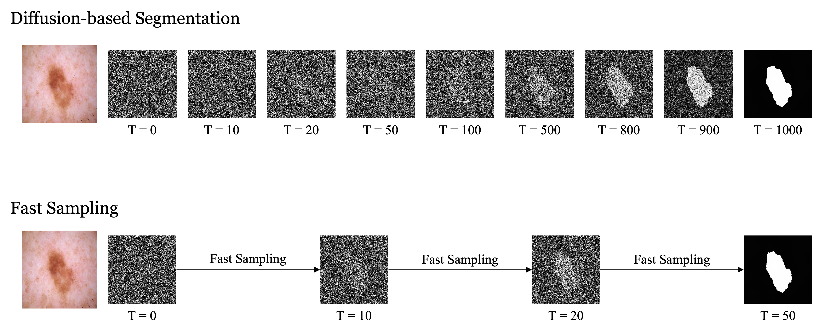
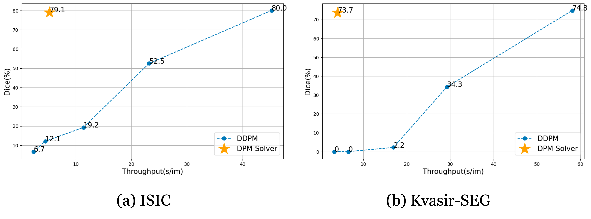
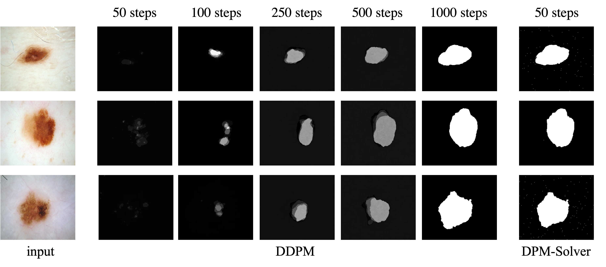

# Exploring Fast Sampling for Diffusion-based Segmentation

## Overview

With the capability of capturing the distribution of real-world data, using the diffusion-based model to address semantic visual tasks has drawn attention from researchers. However, due to the numerous sampling steps required in the reverse process, the deployment of such a model is limited. In this project, we propose to solve the problem by adapting fast sampling techniques into the pipeline. 



We validate our method by incorporating DPM-Solver with MedSegDiff, and did comprehensive experiments on two benchmarks. The first is ISIC for skin lesion segmentation, the second one is KVASIR-Seg for polyp segmentation. Our method shows a 20$\times$ faster mask generation speed while maintaining competitive results.




## Usage

### Requirements

``pip install -r requirement.txt``

### Example Cases

1. Download ISIC (ISBI2016_ISIC_Part3B) dataset from https://challenge.isic-archive.com/data/ and orgsnize as:

```bat
ISIC/
├── ISBI2016_ISIC_Part3B_Test_Data/...
├── ISBI2016_ISIC_Part3B_Training_Data/...
├── ISBI2016_ISIC_Part3B_Test_GroundTruth.csv
└── ISBI2016_ISIC_Part3B_Training_GroundTruth.csv
```

2. For training, run: (about 48 hours on single NVIDIA A40)

```bash
python scripts/segmentation_train.py 
--data_name ISIC 
--data_dir {input_data_directory} --out_dir {output_checkpoint_directory} 
--image_size 256 --num_channels 128 --class_cond False --num_res_blocks 2 
--num_heads 1 --learn_sigma True --use_scale_shift_norm False 
--attention_resolutions 16 --diffusion_steps 1000 --noise_schedule linear 
--rescale_learned_sigmas False --rescale_timesteps False --lr 1e-4 --batch_size 16
```

3. For sampling, run: 

```bash
python scripts/segmentation_sample.py 
--data_name ISIC 
--data_dir {input_data_directory} 
--out_dir {output_sampling_directory} --model_path {output_checkpoint_directory} 
--image_size 256 --num_channels 128 --class_cond False --num_res_blocks 2 
--num_heads 1 --learn_sigma True --use_scale_shift_norm False 
--attention_resolutions 16 --noise_schedule linear --rescale_learned_sigmas False 
--rescale_timesteps False --num_ensemble 5
--diffusion_steps 1000
```

​	For Fast Sampling using DPM-Solver, set: 

```bash
--diffusion_steps 50 --dpm_solver True
```

4. For evaluation, run: 

```bash
python scripts/segmentation_env.py 
--inp_pth {output_sampling_directory} 
--out_pth {folder you save ground truth images}
```

## Acknowledge
Code mainly based on [LuChengTHU/dpm-solver](https://github.com/LuChengTHU/dpm-solver), [WuJunde/MedSegDiff](https://github.com/WuJunde/MedSegDiff), [lucidrains/med-seg-diff-pytorch](https://github.com/lucidrains/med-seg-diff-pytorch).


